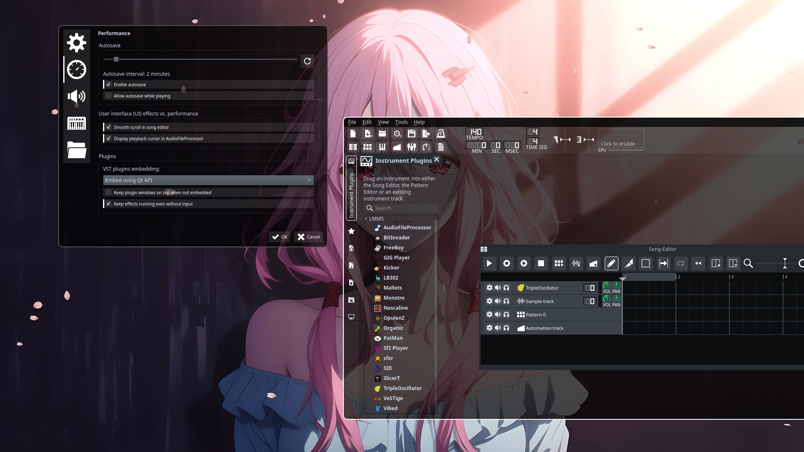
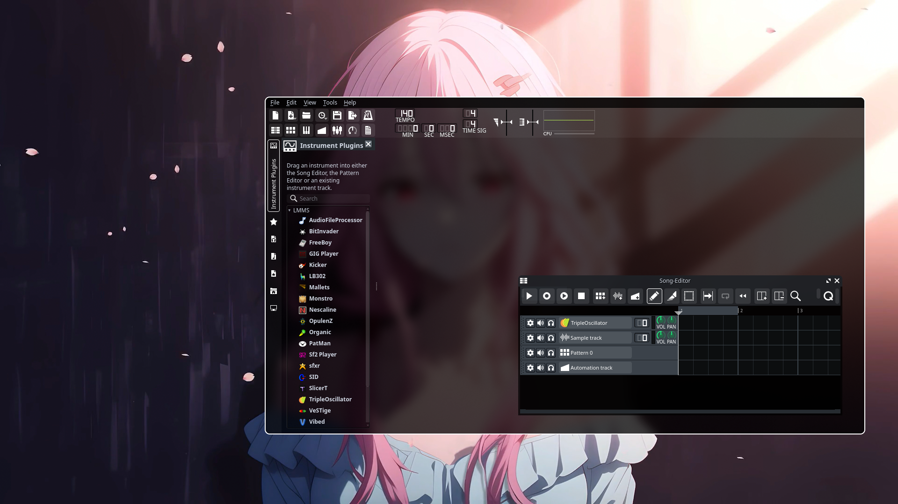

# LMMX3

*LMMX3 is a theme modified from the LMMS default theme. Enjoy ^_^*

## Intro

LMMX3 features translucent background and some other visual enhancement, giving you more comfort in composing (maybe).

The theme is created on LMMS git version 1.3.0-alpha.1.904+bfa04c9 on Arch Linux. LMMS release 1.2.2 can't apply the theme correctly. Also, on qt6 git version 1.3.0-alpha.1.912+0187e64 the translucent background won't take effect (Newer versions not tested).

Windows and macOS not tested.

The theme is not completed. Welcome to PR if you want to make it more pretty ^_^

## Usage

Clone the repo and go to LMMS - Edit - Settings - Paths - Theme directory, set the path to the repo's LMMX3 folder.

Tranlucent background may reduce the readability, you can add blur effect to get a better experience if your compositor supports it (e.g. [Swayfx](https://github.com/WillPower3309/swayfx/), [Hyprland](https://github.com/hyprwm/Hyprland)). 

## Screenshots
Blur off:

Blur on, needs compositor support:

## Thanks

[GIMP](https://www.gimp.org/)

[The original theme](https://github.com/LMMS/artwork)
